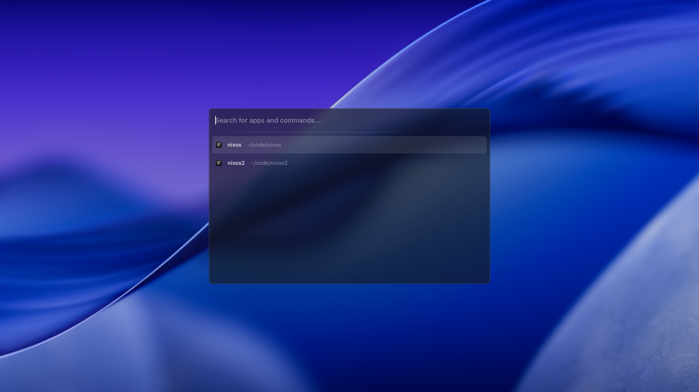

# rofi-zed

> [!WARNING]
> WORK IN PROGRESS. If you are interested in this project,
feel free to contribute

Quickly open Zed Editor recent projects with Rofi.

## Credits

- [Zed Recent Projects Raycast extension](https://www.raycast.com/ewgenius/zed-recent-projects)
- [VSCode mode for Rofi](https://github.com/fuljo/rofi-vscode-mode)

P.S. I'm building this project to learn Rust. Also I'm in love with Rofi
and Zed Editor.
